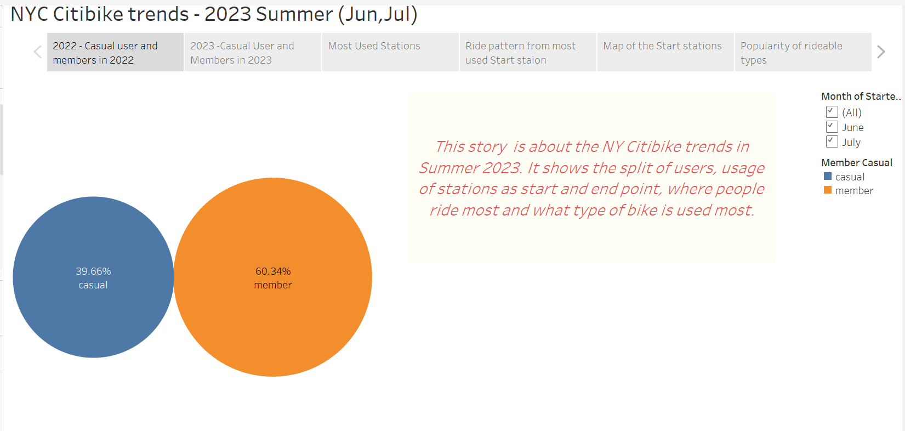
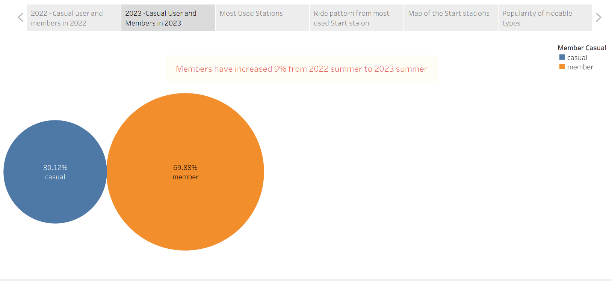
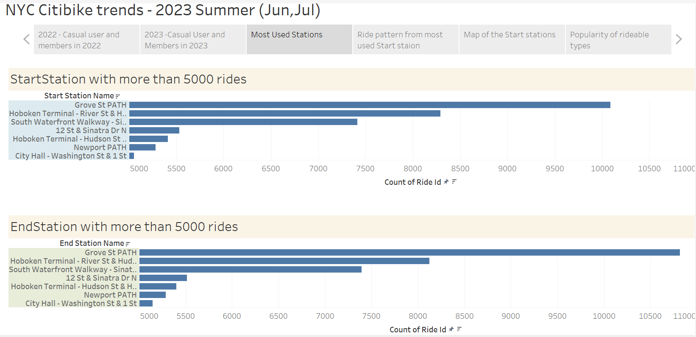
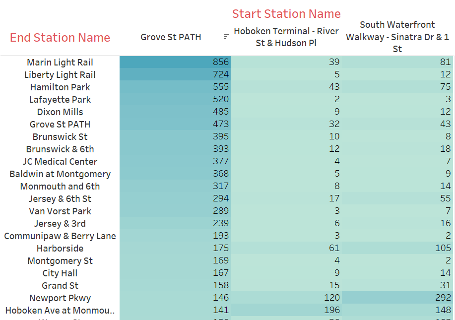
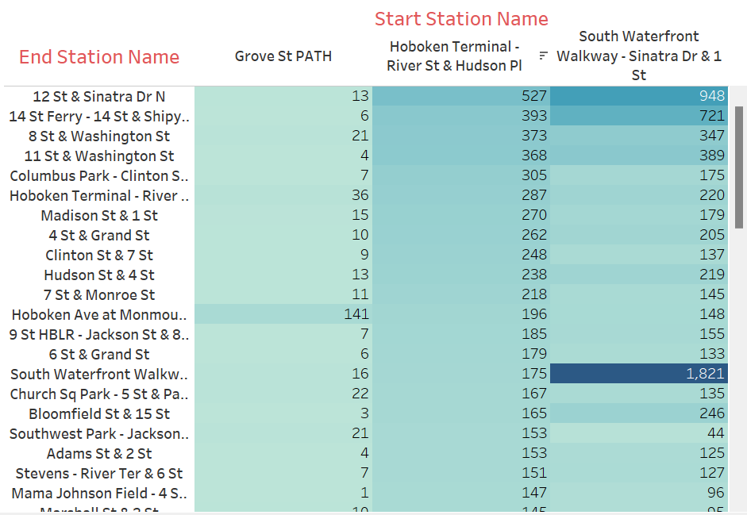
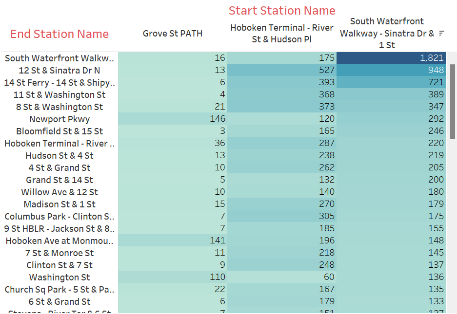
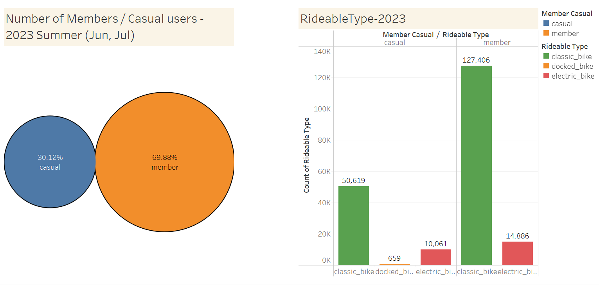
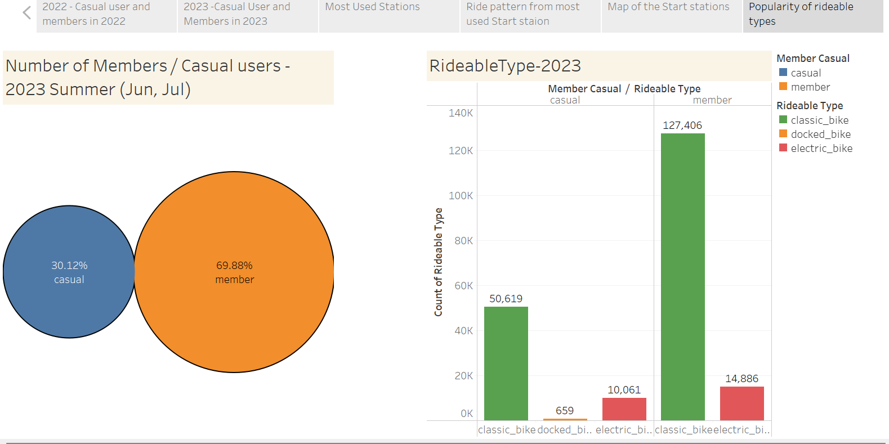

# NY_CitiBike_Reports
Build dashboards for New York Citi Bike data using Tableau

## Data Processing

Analyzed the NY citi bike trip data for Summer (Jun and Jul) of 2022 and 2023. Used Pandas to combine the Jun and Jul data files of 2022 and 2023 into 2 files - one for 2022 and one for 2023 in dataprocessing.ipynb file. The data files are available in the data folder.

Data source: Downloaded Citi Bike trip history data from https://citibikenyc.com/system-data

## Analysis

The NYC_citibike tableau file shows the visualizations of the analysis. The link to the tableau file is :

https://public.tableau.com/app/profile/devi.balao.s/viz/NYC_citibike_17000132802160/NYC_Citibike_Story?publish=yes

### NY_Citibike_Story

Analyzed the citi bike data for the **Summer months of Jun and July 2023**. 

In last Summer (Jun,Jul -2022), out of the total users of the citi bike, 60.34% were members and 39.66% were casual users.

In 2023 Summer, **the members increased 9%** and is 69.88%. This shows that the citi bike project is gaining popularity and more people are taking memberships to use it on a regular basis.

When the most used stations are examined, it is interesting to note that the same stations show up in the list of most used start station and end station. 

#### Grove St PATH topped the list with 10,085 rides started from there and 10,816 rides ended there.

- It is followed by Hoboken Terminal - River St & Hudson PI with 8290 rides started and 8124 rides ended. 

- South Waterfront Walkway - Sinatra Dr & 1 St takes the third lace with 7415 rides started and 7395 rides ended.

#### From Grove St Path most riders go to 
- Marin Light Rail, 
- Liberty Light Rail, 
- Hamilton Park and Lafayette Park.

#### From Hoboken Terminal - River St & Hudson PI, most riders go to 
- 12 St & Sinatra Dr N., 
- 14th St Ferry-14 St & Shipyard Ln, 
- 8th St & Washington St,
- 11 St & Washington St and Columbus Park.

#### In case of South Waterfront Walkway - Sinatra Dr & 1 St it seems that 
- majority of the riders start and end at this station. 
- Most riders go to 12 St & Sinatra Dr N. and 14th St Ferry-14 St & Shipyard Ln from here as well.

### Map of the start stations show the stations. 
- The size of the marker varies based on the number of riders starting from that station .
- The color of the marker indicates the day of the week.

Popularity of rideable types shows that citibike is popular than electric bike among both casual users and members. The reason may be the availability or fare of the bikes. The category docked_bike with count of 659 needs to be analyzed further to determine what it represents.

